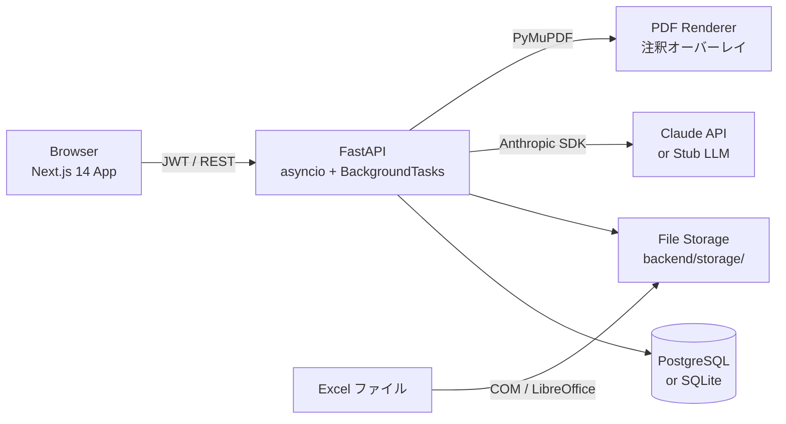
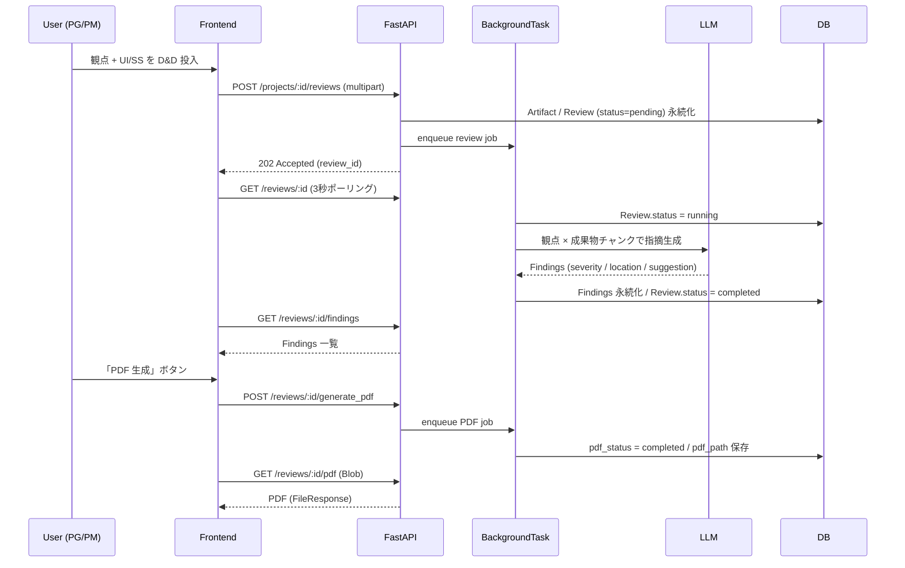

# アーキテクチャ

## システム全体図



## レイヤ構成

```
┌──────────────────────────────────────────────────────────┐
│  Frontend (Next.js 14 / TypeScript / Tailwind)           │
│  ─ App Router (RSC + Client)                             │
│  ─ React Query (server state) / Zustand (auth state)     │
│  ─ Axios + Interceptor (JWT 自動付与 / 401 ハンドル)     │
└─────────────────────┬────────────────────────────────────┘
                      │ REST + JWT
┌─────────────────────▼────────────────────────────────────┐
│  Backend API Layer (FastAPI)                             │
│  ─ ルータ: auth / projects / artifacts / reviews / ...   │
│  ─ Pydantic v2 でリクエスト/レスポンス検証               │
│  ─ Depends で DB セッション・ユーザ注入                  │
└─────────────────────┬────────────────────────────────────┘
                      │
┌─────────────────────▼────────────────────────────────────┐
│  Service Layer                                           │
│  ─ review_engine     レビュー実行オーケストレーション    │
│  ─ aspect_parser     観点ファイル (Excel/TXT) パーサ     │
│  ─ pdf_generation    Excel→PDF + 注釈オーバーレイ       │
│  ─ project_service   認可・所有権チェック                │
│  ─ job_runner        BackgroundTasks 抽象化              │
│  ─ pii_masking       プロンプトに乗せる前の匿名化        │
└─────────────────────┬────────────────────────────────────┘
                      │
┌─────────────────────▼────────────────────────────────────┐
│  Adapter / Infrastructure                                │
│  ─ llm/anthropic_client   本番用 Claude クライアント    │
│  ─ llm/stub_client        開発・CI 用 Stub              │
│  ─ parsers/xlsx,docx,pdf  成果物パーサ                  │
│  ─ db (SQLAlchemy 2.x asyncio + Alembic)                │
└──────────────────────────────────────────────────────────┘
```

## レビュー実行シーケンス



## データモデル (主要 8 テーブル)

```
users           ── id / email / hashed_password / role / created_at
  └─ owns ──▶ projects
projects        ── id / owner_id / name / phases[]
  └─ has   ──▶ artifacts / reviews / aspects
artifacts       ── id / project_id / phase / file_path / version
reviews         ── id / project_id / review_type / target_artifact_ids[]
                   aspect_ids[] / status / pdf_status / pdf_path
findings        ── id / review_id / severity / location / content / suggestion
finding_responses ── finding_id / status (not_started / in_progress / done / na)
                                           / comment / updated_by
aspects         ── id / category / name / description / is_active
knowledges      ── id / scope / content (将来の Findings 学習用 placeholder)
```

## LLM 抽象化

```python
# backend/app/llm/base.py
class LLMClient(Protocol):
    async def review(
        self, *, prompt: str, system: str, timeout_s: float
    ) -> LLMReviewResult: ...

# 切替は環境変数 LLM_PROVIDER で制御
#   stub      → StubLLMClient (固定 2 件返却。CI / 開発でゼロコスト)
#   anthropic → AnthropicClient (本番。tenacity でリトライ)
```

## エラーハンドリング戦略

| レイヤ | 方針 |
|---|---|
| API | HTTPException + Pydantic ValidationError → 422 |
| Service | ドメイン例外 (`ReviewNotReady`, `AspectInvalid` 等) を投げ、API 層で HTTP に変換 |
| LLM | tenacity リトライ (最大 3 回 / exponential backoff) → それでも失敗時は `Review.status=failed` + `error_message` 永続化 |
| BG Job | 例外は必ず捕捉し DB に記録。フロントは status=failed を見て表示切替 |

## セキュリティ

- **認証**: JWT (HS256) / アクセストークン 60 分 / `Authorization: Bearer ...`
- **パスワード**: bcrypt (cost=12)
- **認可**: `project.owner_id == current_user.id` を全 API で確認
- **ファイル**: アップロード先は `backend/storage/<project_id>/<artifact_id>.<ext>` (UUID 化、推測不可)
- **PII マスキング**: LLM 送信前に `pii_masking.PiiMaskRule` で氏名・社名・電話・メールを伏字化 (拡張可能)

## デプロイ想定 (AWS)

```
[Route 53] ─▶ [CloudFront] ─▶ [ALB]
                                  │
              ┌───────────────────┴────────────────────┐
              ▼                                        ▼
   [EC2 / Windows Server]                   [EC2 / Amazon Linux]
   ─ Excel COM (Office インストール)          ─ LibreOffice fallback
   ─ uvicorn + FastAPI                        ─ Frontend (Next.js standalone)
              │                                        │
              └────────┬───────────────────────────────┘
                       ▼
                [RDS PostgreSQL]
                       ▼
                  [S3 (storage)]
```

理由: 本番 Excel→PDF 変換は **Excel COM が最も忠実**なため Windows Server を主にする。Linux 側は LibreOffice fallback で軽量パスを担う。
